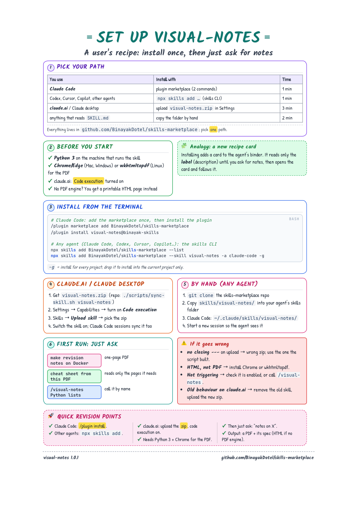

# skills-marketplace

Reusable skills for AI agents. Each skill is a folder with a `SKILL.md` that follows the open [Agent Skills](https://agentskills.io/specification) format, so it works in Claude (Code, desktop, claude.ai) and in other agents that read the same format, such as Codex, Cursor and GitHub Copilot.

## See it

<a href="docs/showcase/visual-notes-setup/visual-notes-setup.pdf"></a>

This setup guide was made by `visual-notes` itself. The agent wrote the content as a [JSON spec](docs/showcase/visual-notes-setup/visual-notes-setup.spec.json), and the skill's renderer turned it into [this A4 PDF](docs/showcase/visual-notes-setup/visual-notes-setup.pdf). The agent never writes HTML, so every page has the same look.

The same spec gives the same page every time. To check, render it yourself:

```bash
python3 skills/visual-notes/scripts/render_note.py \
  docs/showcase/visual-notes-setup/visual-notes-setup.spec.json /tmp/setup.html --pdf-only
```

`docs/` is not part of any skill, so installs stay small.

<br clear="right">

## Skills

| Skill | What it does | Version |
|---|---|---|
| [visual-notes](skills/visual-notes/) | Turns a topic, document or rough notes into a hand-drawn-style one-page study sheet (cheat sheet / revision notes) as a printable A4 PDF. | 1.0.2 |

## Install

**Claude Code** (plugin marketplace):

```
/plugin marketplace add BinayakDotel/skills-marketplace
/plugin install visual-notes@binayak-skills
```

**Any supported agent** ([skills CLI](https://github.com/vercel-labs/skills): Claude Code, Codex, Cursor, Copilot and more):

```bash
npx skills add BinayakDotel/skills-marketplace --list                   # see what's here
npx skills add BinayakDotel/skills-marketplace --skill visual-notes     # pick an agent when asked
npx skills add BinayakDotel/skills-marketplace --skill visual-notes -a claude-code -g   # global, no prompt
```

**claude.ai / Claude desktop**: build `dist/visual-notes.zip` with `./scripts/sync-skill.sh visual-notes`, then Settings → Capabilities → Skills → Upload skill. Code execution must be on.

**By hand**: copy `skills/<name>/` into your agent's skills folder (for Claude Code, `~/.claude/skills/<name>/`).

Some skills run bundled scripts, so the agent needs a shell. `visual-notes` needs Python 3, plus headless Chrome/Edge or wkhtmltopdf for the PDF. Without them it delivers the HTML page instead.

## Layout

```
.claude-plugin/marketplace.json   catalog: one plugin per skill (marketplace name: binayak-skills)
skills/<name>/                    SKILL.md, scripts/, references/, assets/, examples/, CHANGELOG.md
scripts/validate.py               checks every skill against the spec and the catalog (also run in CI)
scripts/sync-skill.sh             validate -> link into ~/.claude/skills -> build dist/<name>.zip
```

## Working on a skill

```bash
./scripts/sync-skill.sh visual-notes    # once: symlinks ~/.claude/skills/visual-notes to this repo, so edits apply instantly
# edit skills/visual-notes/...
./scripts/sync-skill.sh visual-notes    # re-validate and rebuild the zip; says when claude.ai needs a re-upload
```

To add a skill:

1. Create `skills/<name>/SKILL.md`. The frontmatter `name` must equal the folder name: lowercase letters, digits and single hyphens.
2. Add a plugin entry to `.claude-plugin/marketplace.json` with `"source": "./skills/<name>"`.
3. Add a row to the table above and a `CHANGELOG.md` in the skill folder.
4. Run `python3 scripts/validate.py`.

When you change a skill, bump its `version` in `marketplace.json` so Claude Code users get the update.

## Credits

The look of `visual-notes` is inspired by the hand-drawn revision notes of the Developer Blz notebook series and similar Python revision-notes pages. No branding from them is used.

## License

[MIT](LICENSE). Bundled fonts in `skills/visual-notes/assets/fonts/` are under the SIL Open Font License ([LICENSE-OFL.txt](skills/visual-notes/assets/fonts/LICENSE-OFL.txt)).
